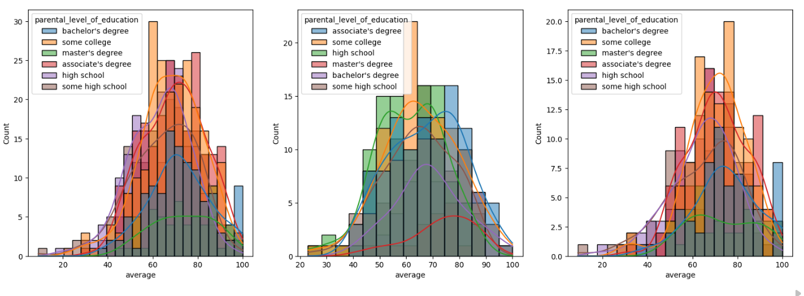
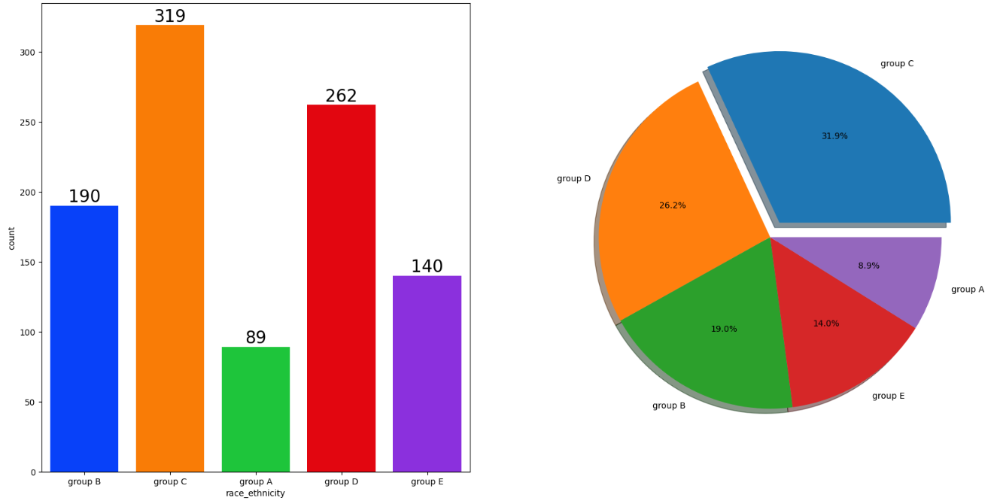
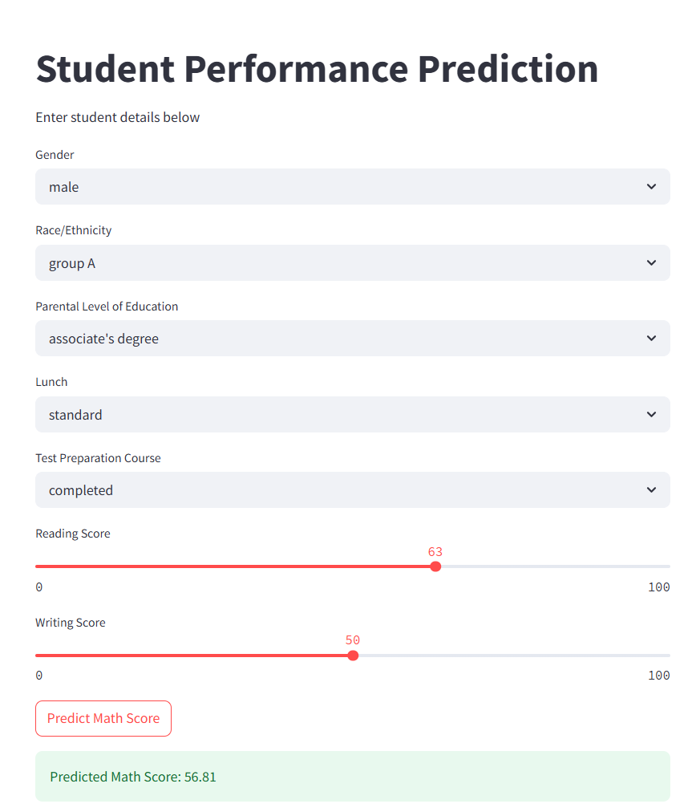

# 🎓 Student Performance Prediction

## Overview

Student Performance Prediction is an end-to-end Machine Learning project designed to predict students' math scores based on demographic, educational, and academic factors.

The project follows a complete ML workflow including:
- Data Ingestion
- Data Preprocessing
- Exploratory Data Analysis (EDA)
- Feature Engineering
- Model Training
- Hyperparameter Tuning
- Model Evaluation
- Deployment using Streamlit

The application predicts student performance using inputs such as:
- Gender
- Race/Ethnicity
- Parental Level of Education
- Lunch Type
- Test Preparation Course
- Reading Score
- Writing Score

---

# 🚀 Features

- End-to-End Machine Learning Pipeline
- Exploratory Data Analysis with Visualizations
- Multiple Regression Models Comparison
- Hyperparameter Tuning using GridSearchCV
- Modular Code Structure
- Custom Exception Handling & Logging
- Saved Model & Preprocessor Pipelines
- Interactive Streamlit Web Application
- Deployment Ready

---

# 🛠️ Tech Stack

- Python
- Pandas
- NumPy
- Scikit-learn
- CatBoost
- XGBoost
- Matplotlib
- Seaborn
- Streamlit
- Flask (Initial Version)

---

# 📂 Project Structure

```bash
Student_Performence_prediction/
│
├── artifacts/
│   ├── model.pkl
│   ├── proprocessor.pkl
│   ├── train.csv
│   ├── test.csv
│   └── data.csv
│
├── notebook/
│
├── src/
│   ├── components/
│   │   ├── data_ingestion.py
│   │   ├── data_transformation.py
│   │   └── model_trainer.py
│   │
│   ├── pipeline/
│   │   └── predict_pipeline.py
│   │
│   ├── exception.py
│   ├── logger.py
│   └── utils.py
│
├── templates/
│
├── application.py
├── streamlit_app.py
├── requirements.txt
├── setup.py
└── README.md
```

---

# 📊 Dataset Information

The dataset contains **1000 student records** with demographic and academic features.

## Features

| Feature | Description |
|---|---|
| gender | Male / Female |
| race_ethnicity | Group A-E |
| parental_level_of_education | Parent education level |
| lunch | Standard / Free-Reduced |
| test_preparation_course | Completed / None |
| reading_score | Reading marks |
| writing_score | Writing marks |
| math_score | Target Variable |

---

# 🔍 Exploratory Data Analysis (EDA)

Extensive EDA was performed using Seaborn and Matplotlib to understand patterns, distributions, and feature relationships.

---

# 📌 Univariate Analysis

Univariate analysis was used to study the distribution of individual variables in the dataset.

### Insights:
- Group C students had the highest representation.
- Group A had the lowest representation.
- Most parents had some college or associate degree education levels.
- Student scores followed approximately normal distributions.

### Sample Univariate Analysis



---

# 📈 Data Visualizations

Different visualizations were created to understand trends and feature relationships.

### Visualizations Included:
- Bar Charts
- Pie Charts
- Histograms
- KDE Plots
- Correlation Analysis
- Distribution Plots

### Key Insights:
- Reading and writing scores are strongly correlated with math scores.
- Students completing test preparation courses performed better.
- Students with standard lunch generally scored higher.
- Female students performed better in reading and writing scores.
- Higher parental education positively impacted student performance.

### Sample Visualization



---

# 📉 Score Distribution Analysis

Distribution plots were used to analyze score patterns across various parental education levels.

### Observations:
- Scores are approximately normally distributed.
- Students with educated parents tend to score higher.
- Some outliers exist in low score ranges.

### Sample Distribution Analysis


---

# 🤖 Machine Learning Models Used

The following regression models were trained and evaluated:

- Linear Regression
- Lasso Regression
- Ridge Regression
- K-Neighbors Regressor
- Decision Tree Regressor
- Random Forest Regressor
- XGBoost Regressor
- CatBoost Regressor
- AdaBoost Regressor

---

# 🏆 Best Performing Model

- CatBoost Regressor
- XGBoost Regressor

Achieved approximately:
- **~90% R² Score**

---

# ⚙️ ML Pipeline

The ML pipeline includes:

1. Data Ingestion
2. Data Transformation
3. Feature Encoding
4. Scaling
5. Model Training
6. Hyperparameter Tuning
7. Model Evaluation
8. Prediction Pipeline

---

# 🌐 Streamlit Web Application

The project includes an interactive Streamlit web app for real-time predictions.

## Features:
- User-friendly interface
- Dropdown-based inputs
- Real-time predictions
- Interactive sliders
- Fast inference using saved model artifacts

### Sample Streamlit App



---

# ▶️ Installation

## Clone Repository

```bash
git clone https://github.com/pullangari-vedaprakash/Student_Performence_prediction.git
```

---

## Create Virtual Environment

```bash
python -m venv venv
```

### Activate Environment

#### Windows

```bash
venv\Scripts\activate
```

#### Linux/Mac

```bash
source venv/bin/activate
```

---

## Install Dependencies

```bash
pip install -r requirements.txt
```

---

# ▶️ Run Streamlit Application

```bash
streamlit run streamlit_app.py
```

---

# 🎯 Prediction Example

## Input:
- Gender: Female
- Race/Ethnicity: Group B
- Parental Education: Bachelor's Degree
- Lunch: Standard
- Test Preparation Course: Completed
- Reading Score: 75
- Writing Score: 80

## Output:
- Predicted Math Score: 78.45

---

# 📌 Future Improvements

- Add Deep Learning Models
- Add Model Explainability (SHAP)
- Docker Deployment
- CI/CD Integration
- Cloud Deployment
- Authentication System
- Advanced Analytics Dashboard

---

# 🤝 Contributing

Contributions are welcome.

Steps:
1. Fork Repository
2. Create Feature Branch
3. Commit Changes
4. Push Changes
5. Create Pull Request

---

# 📜 License

This project is licensed under the MIT License.

---

# 🙌 Acknowledgements

- Kaggle Dataset Inspiration
- Scikit-learn Documentation
- CatBoost Documentation
- Streamlit Documentation

---

# 👨‍💻 Author

Vedaprakash Pullangari

GitHub:
https://github.com/pullangari-vedaprakash
